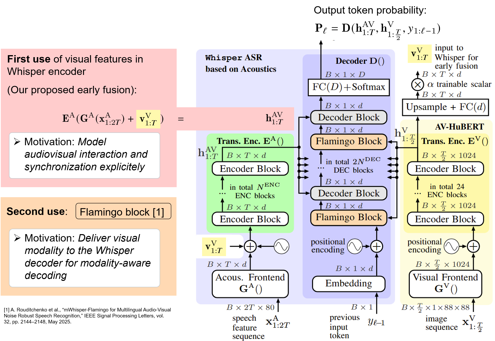

# Dual-Use-AVASR

This repository contains the code for the ICASSP 2026 paper
["Noise-Robust AV-ASR Using Visual Features Both in the Whisper Encoder and Decoder"].
The method builds on Whisper-style audio recognition and adds visual features in both the encoder and decoder for noise-robust audio-visual automatic speech recognition (AV-ASR).

<p align="center">
  
</p>

## Getting Started

This codebase follows several public projects for setup and preprocessing:

- Environment setup follows [mWhisper-Flamingo](https://github.com/roudimit/whisper-flamingo).
- Data preprocessing and MUSAN noise preprocessing follow [AV-HuBERT](https://github.com/facebookresearch/av_hubert).
- NoiseX processing follows [Auto-AVASR](https://github.com/mpc001/auto_avsr).

Prepare the environment and datasets with those reference instructions, then update the local paths in this repository's Slurm scripts and config files. In particular, replace machine-specific values such as `CONDA_ROOT`, the repository `cd` path, `noise_fn`, `noise_fn_val`, `noise_fn_test`, `pt_ckpt`, `video_model_ckpt`, and `av_hubert_path`.

The README examples below use repo-relative paths. The checked-in Slurm scripts and configs may still contain cluster-specific absolute paths from the original training environment, so adjust them before submitting jobs on a new machine.

## Training

We use two-stage fine-tuning, similar to the reference mWhisper-Flamingo training recipe.

### Stage 1: Audio-Only Fine-Tuning

Audio-only configs are in [`config/audio`](config/audio). The Slurm entry point is [`slurm/train_audio.sh`](slurm/train_audio.sh), which launches [`whisper_ft_audio.py`](whisper_ft_audio.py).

Example Slurm command:

```bash
cd /path/to/Dual-Use-AVASR

# Edit slurm/train_audio.sh first:
# - set CONDA_ROOT and the conda environment name
# - set the repository cd path
# - choose a config under config/audio
sbatch slurm/train_audio.sh
```

Example direct command inside an activated environment:

```bash
cd /path/to/Dual-Use-AVASR
python -u whisper_ft_audio.py config/audio/audio_en_tiny.yaml
```

Other available audio-only configs include:

```text
config/audio/audio_en_base.yaml
config/audio/audio_en_large.yaml
config/audio/audio_en_medium.yaml
config/audio/audio_en_small.yaml
config/audio/audio_en_tiny.yaml
```

### Stage 2: Audio-Visual Fine-Tuning

Audio-visual configs are in [`config/audio-visual`](config/audio-visual). The Slurm entry point is [`slurm/train_av.sh`](slurm/train_av.sh), which launches [`whisper_ft_av.py`](whisper_ft_av.py).

Before this stage, set the `pt_ckpt` field in the selected audio-visual config to the checkpoint produced by Stage 1. Also set `video_model_ckpt` and `av_hubert_path` for your environment.

The audio-visual configs expose the main fusion variants through `fusion_mode`:

| `fusion_mode` | Implementation | Description |
|---|---|---|
| `baseline` | `av_fusion=separate`, `add_gated_x_attn=1` | Whisper-Flamingo-style baseline. Visual features are kept as a separate stream and used by gated cross-attention in the Whisper decoder. |
| `early_fusion` | `av_fusion=effusion`, `add_gated_x_attn=0` | Encoder-only visual fusion. Projected visual features are added to the audio features before the Whisper encoder, while the decoder only attends to the encoded audio-visual representation. |
| `dual_use` | `av_fusion=effusion`, `add_gated_x_attn=1` | Main dual-use setting. Projected visual features are added before the Whisper encoder and are also passed as visual features to the decoder gated cross-attention. |
| `dual_use_concat` | `av_fusion=dual_use_concat`, `add_gated_x_attn=1` | Dual-use variant where audio and visual encoder inputs are concatenated and projected instead of added, while the decoder still receives visual features through gated cross-attention. |

Set the mode in the selected YAML config, for example:

```yaml
# fusion_mode: baseline | early_fusion | dual_use | dual_use_concat
fusion_mode: dual_use
```

Example Slurm command:

```bash
cd /path/to/Dual-Use-AVASR

# Edit slurm/train_av.sh first:
# - set CONDA_ROOT and the conda environment name
# - set the repository cd path
# - choose a config under config/audio-visual
sbatch slurm/train_av.sh
```

Example direct command inside an activated environment:

```bash
cd /path/to/Dual-Use-AVASR
python -u whisper_ft_av.py config/audio-visual/lrs3/av_en_tiny_short_training_dual_use.yaml
```

Example LRS3 audio-visual configs:

```text
config/audio-visual/lrs3/av_en_base_short_training_dual_use.yaml
config/audio-visual/lrs3/av_en_medium_long_training_dual_use.yaml
config/audio-visual/lrs3/av_en_small_long_training_dual_use.yaml
config/audio-visual/lrs3/av_en_tiny_short_training_dual_use.yaml
```

## Inference

Audio-only inference can be launched with [`slurm/whisper_decode_wrapper_audio_only_en.sh`](slurm/whisper_decode_wrapper_audio_only_en.sh). The wrapper sets the checkpoint, model size, noise manifests, decoding mode, beam size, SNR values, and split loop, then submits [`slurm/whisper_decode.sh`](slurm/whisper_decode.sh).

Example wrapper command:

```bash
cd /path/to/Dual-Use-AVASR

# Edit slurm/whisper_decode_wrapper_audio_only_en.sh first:
# - checkpoint: path to the fine-tuned audio checkpoint, unless use_original_whisper=1
# - model: Whisper model size, e.g. tiny.en, base.en, small.en, medium.en
# - noise_fn_test and noise_fn_val: prepared MUSAN/NoiseX noise TSV files
# - decode_path: output directory for hypotheses and scores
# - use_original_whisper: set 0 to decode a fine-tuned checkpoint
bash slurm/whisper_decode_wrapper_audio_only_en.sh
```

The wrapper currently evaluates English ASR over the `test` and `valid` splits with SNR values `-10`, `-5`, `0`, `5`, `10`, and `1000`. Edit the loops in the wrapper to change the language, split, beam size, or SNR schedule.

A single-job version using the underlying Slurm script looks like this:

```bash
cd /path/to/Dual-Use-AVASR

sbatch slurm/whisper_decode.sh \
  en \
  tiny.en \
  0 \
  /path/to/noise/babble/test.tsv \
  /path/to/checkpoint.ckpt \
  1 \
  asr \
  0 \
  None \
  1 \
  decode_whisper_baseline/ \
  /path/to/av_hubert/avhubert \
  /path/to/avhubert_or_mavhubert_weights.pt \
  transcribe \
  fairseq \
  0 \
  test
```

For audio-only decoding, use `modalities=asr`, `use_av_hubert_encoder=0`, and `av_fusion=None`. For clean decoding, use a high SNR value such as `1000`.

## Acknowledgements

Thank you to the authors and maintainers of the repositories that this work builds on, especially [mWhisper-Flamingo](https://github.com/roudimit/whisper-flamingo), [AV-HuBERT](https://github.com/facebookresearch/av_hubert), [Auto-AVASR](https://github.com/mpc001/auto_avsr), and [OpenAI Whisper](https://github.com/openai/whisper). Their public code and recipes made this work possible.

## Citation

If you use this repository, please cite:

```bibtex
@inproceedings{Li2026,
	title     = {{Noise-Robust AV-ASR Using Visual Features Both in the Whisper Encoder and Decoder}},
	author    = {Zhengyang Li and Thomas Graave and Björn Möller and Zehang Wu and Matthias Franz and Tim Fing\-scheidt},
	year      = {2026},
	month = may,
	address = {Barcelona, Spain},
	booktitle = {Proc.\ of ICASSP},
	pages     = {17937--17941},
}
```
